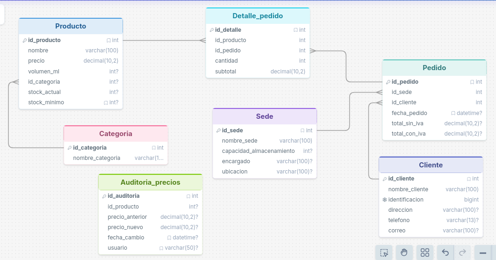
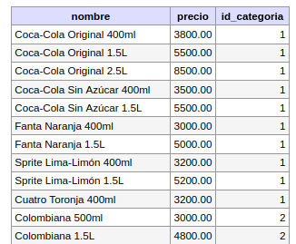
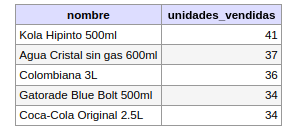

# 🥤 Sistema de Gestión: Gaseosas del Valle S.A.

## 📝 1. Descripción del Proyecto
Este proyecto consiste en el diseño e implementación de una base de datos relacional robusta para la distribuidora **Gaseosas del Valle**. El sistema está diseñado para gestionar el ciclo completo de ventas, desde la administración de productos y categorías hasta el seguimiento detallado de pedidos por sede y la auditoría de seguridad en los precios.

**Objetivos clave:**
* **Integridad de Datos:** Uso estricto de llaves foráneas y reglas `ON DELETE`.
* **Automatización:** Reducción de errores manuales mediante triggers.
* **Inteligencia de Negocio:** Vistas predefinidas para la toma de decisiones rápidas.

---

## 🗺️ 2. Modelo Entidad-Relación (E-R)
El modelo conceptual se basa en la interacción de 6 entidades principales, resolviendo la relación de "Muchos a Muchos" entre Pedidos y Productos mediante una tabla de ruptura técnica.

* **Entidades:** `Sede`, `Categoria`, `Producto`, `Cliente`, `Pedido`.
* **Relación Detallada:** `Detalle_pedido` conecta los productos con sus respectivas facturas.
* **Auditoría:** `Auditoria_precios` mantiene la trazabilidad de cambios sensibles.

---

## ⚙️ 3. Lógica Programada

### Triggers (Disparadores)
* **`tr_actualizar_stock`**: Al registrar un nuevo ítem en `Detalle_pedido`, descuenta automáticamente la cantidad del `stock_actual` en la tabla `Producto`.
* **`tr_auditar_cambio_precio`**: Si un administrador modifica el precio de un producto, el sistema guarda el valor anterior, el nuevo, el usuario y la fecha exacta del cambio.

### Funciones (UDF)
* **`fn_calcular_total_con_iva(id_pedido)`**: Recibe el ID de un pedido y retorna el monto total sumando el 19% de IVA de manera automática.
* **`fn_validar_stock(id_producto, cantidad)`**: Retorna un mensaje preventivo (Ej: "Stock insuficiente") antes de intentar procesar una venta.

---

## 📊 4. Reportes y Consultas (Vistas)
Se implementaron vistas para facilitar la lectura de datos complejos:
1.  **`vista_resumen_pedidos_por_sede`**: Total de ventas agrupadas por ubicación física.
2.  **`vista_productos_bajo_stock`**: Reporte crítico de productos que alcanzaron su stock mínimo.
3.  **`vista_clientes_activos`**: Listado de clientes que han generado al menos una transacción.

## 5  Ejemplos de Consultas SQL:
```sql
-- Buscar productos de categorías específicas (Gaseosas y Aguas)
SELECT nombre, precio FROM Producto WHERE id_categoria IN (1, 2, 3);
```

```sql
-- Ranking de los 5 productos más vendidos
SELECT pr.nombre, SUM(dp.cantidad) AS unidades 
FROM Producto pr 
JOIN Detalle_pedido dp ON pr.id_producto = dp.id_producto 
GROUP BY pr.nombre ORDER BY unidades DESC LIMIT 5;
```


## 🚀 6. Recomendaciones y Expansión Futura

Para asegurar la escalabilidad y el rendimiento óptimo del sistema **Gaseosas del Valle** a largo plazo, se sugieren las siguientes implementaciones:

### 🛡️ Seguridad y Control de Acceso
* **Gestión de Roles (RBAC):** Implementar tablas de `Usuarios` y `Roles` para diferenciar permisos entre administradores (que pueden cambiar precios), vendedores (que solo crean pedidos) y personal de bodega.
* **Cifrado de Datos:** Asegurar que información sensible como correos electrónicos o contraseñas (en caso de login) se almacenen utilizando algoritmos de hashing como `BCRYPT`.

### 📈 Optimización de Rendimiento
* **Indexación Estratégica:** Crear índices (`INDEX`) en las columnas de búsqueda frecuente como `nombre_cliente`, `nombre_producto` y `fecha_pedido` para mantener la velocidad de respuesta cuando la base de datos supere los 100,000 registros.
* **Mantenimiento de Auditoría:** Implementar una tarea programada (*Event Scheduler*) para archivar registros de auditoría de más de un año en tablas históricas, evitando el crecimiento excesivo de la tabla activa.

### ⚙️ Automatización Avanzada
* **Módulo de Compras:** Crear un trigger que genere una alerta o inserte un registro en una tabla de `Ordenes_Compra` automáticamente cuando un producto aparezca en la `vista_productos_bajo_stock`.
* **Soft Delete:** En lugar de usar `DELETE`, agregar una columna `activo (TINYINT)` en las tablas maestras (Clientes, Productos) para desactivar registros sin romper la integridad referencial histórica.

### 📱 Integración con Backend
* **Desarrollo de API:** Se recomienda el uso de **Python (Flask o FastAPI)** o **Node.js** para conectar esta base de datos con una interfaz de usuario, aprovechando las funciones y vistas ya creadas para reducir la lógica en el código del servidor.

---

**© 2026 - Proyecto Desarrollado por Felipe Corzo** *Junior Developer | Full Stack & Backend Enthusiast*